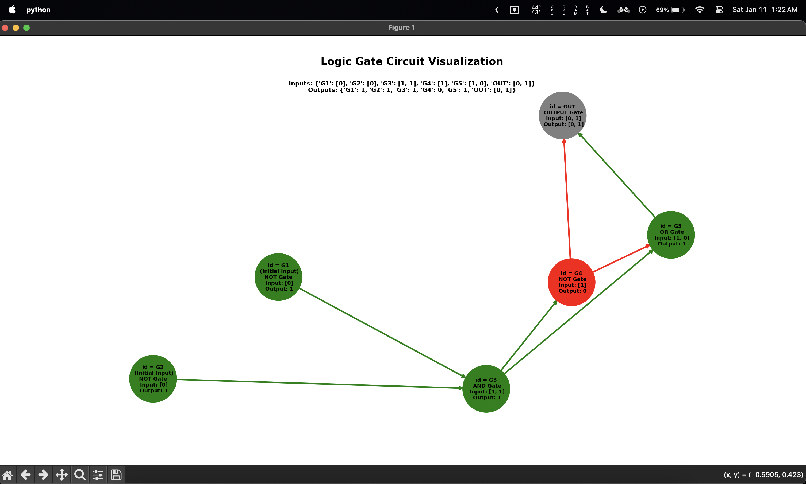
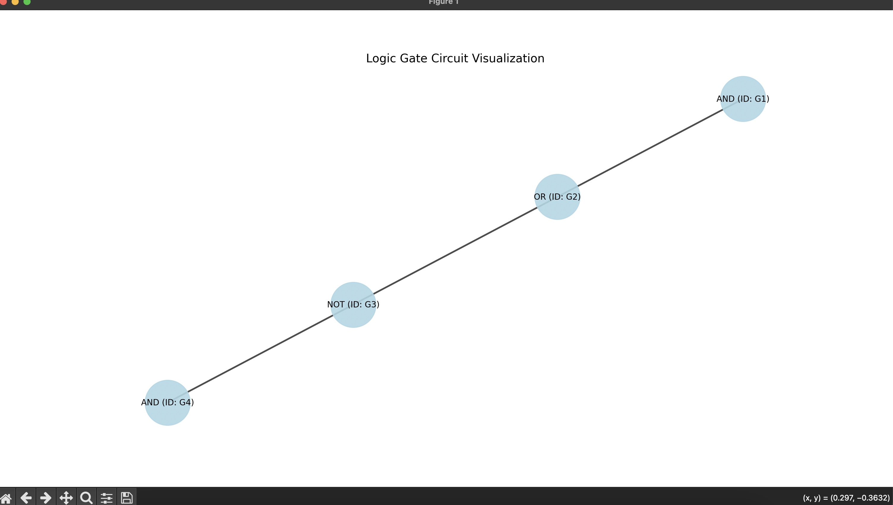
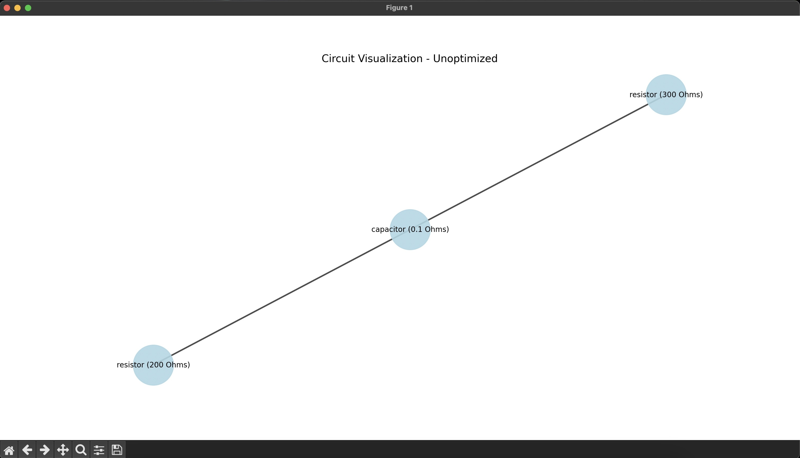
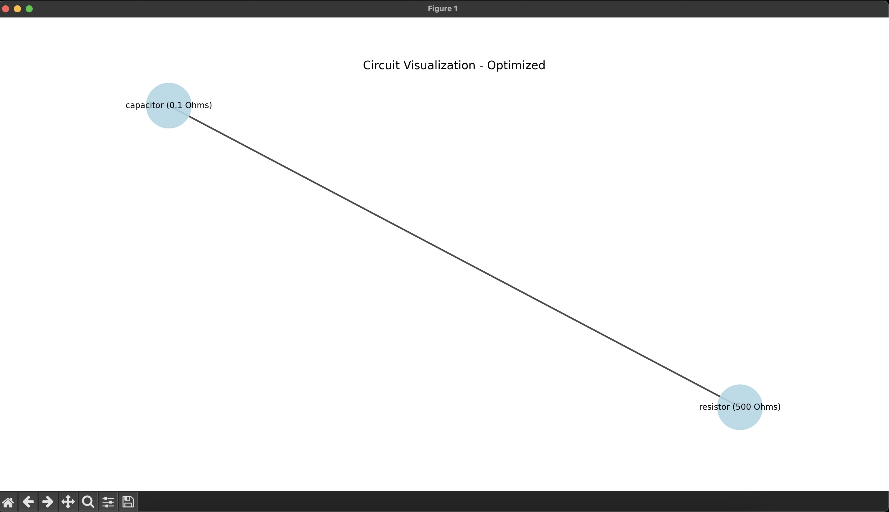

# Neural Network Circuit Optimizer 

The **Neural Network Circuit Optimizer** project aims to optimize simple **digital circuits** using **machine learning**, **circuit simulation**, and **optimization algorithms**. This tool leverages a **neural network** to improve circuit efficiency by minimizing component count meaning it reduces the number of components in a digital circuit while maintaining its functionality. This can lead to smaller, faster, and more energy-efficient designs.

- **NOTE**: By Circuit i mean a digital circuit, this contains logic gates like AND, OR, NOT, etc. NOT resistors or capacitors etc.
- **NOTE**: This project uses my own custom made digital circuit simulator.
- **NOTE**: This project is under development please see the bottom of the page for the current version and progress.

## Technologies and Algorithms

- **NumPy & Pandas**: Used for data manipulation, numerical operations, and organizing circuit data.
- **SymPy**: Helps simplify Boolean logic expressions for circuit optimization.
- **NetworkX**: Represents circuits as graphs, making it easier to analyze and optimize them.
- **Matplotlib**: Visualizes circuit optimizations and results.
- **TensorFlow/PyTorch**: Used to train a neural network/LLM for advanced optimization of circuits.
- **SQLAlchemy**: Manages database interactions for storing circuit data and optimization results.
- **Scikit-learn**: Implements machine learning algorithms for optimization tasks.
- **JupyterNotebook/Labs**: Provides an interactive environment for development, testing, and visualization.
- **Pytest**: Used for unit testing and ensuring code quality.
- **pytourch**: Used for training the neural network and making test LLMS with custom data sets.

## Project Structure

```
NeuralNetworkCircuitOptimizer/
│
├── data/                    # Contains input circuits and testing data (JSON files)
├── notebooks/               # Jupyter notebooks for experimentation with algorithms (ipynb)
│   ├── pytorch_tests        # tests for pytorch using custom data to build a mini LLM
│   ├── scikitlearn_tests    # tests for scikit learn for testing data accuracy  
│   └── tensorflow_tests      # tests for tesnsorflow for testing neural networks 
├── src/                     # Core Python modules for parsing, optimization, simulation, and visualization + cpp files for the graph
│   ├── circuit.py           # Optimizes the circuit using ML algorithms
│   ├── component.py         # Creates the circuit components and adds connections between them
│   ├── logic_func.py        # Holds the definition (i.e the logic) for all the logic gates in to circuit, giving outputs for there inputs
│   ├── optimizer.py         # Optimizes the circuit using simple formulas and algorithms to advanced ML algorithms
│   ├── parser.py            # Parses circuit data (JSON format)
│   ├── simulator.py         # Simulates the circuit behavior using test cases
│   ├── visualizer.py        # Visualizes the optimization process and results (displays the circuit as a graph)
│   └── graph.cpp            # cpp file with a test graph to repersent the circuit
├── tests/                   # pytest Unit tests for ensuring correctness
├── requirements.txt         # Lists project dependencies
└── main.py                  # Main entry point to run the program
```

## Project Details

- **Circuit Creation**: a Circuits is created using the circuit file where we use the components file to add connection between components and create new ones this collection of components is the circuit. This circuit data is given in a json file and we extract and parse it using the parser file.
- **Optimization**: This file creates a circuit using the circuit file then The circuit is then optimized using a combination of simple formulas and machine learning algorithms this all happens in the optimizer file which has many methods to optimize the circuit.
- **Simulation and Visualization**: The optimized circuit is then simulated using test cases for ex using a test voltage source, this simulated result is returned. Lastly we simulate the optimized circuit as a graph for the user too see.

## End Goal
The main goal of this project is to optimize small digital circuits by using machine learning techniques, specifically a neural network, to minimize the complexity of circuits. This involves reducing the gate count, power usage, and execution time, improving overall efficiency. The project also serves as a great introduction to applying neural networks in hardware optimization along with my own custom algorithms for simplifying the circuit.

## V3 of the project (latest and greatest)
While i continue the project with digital logics i add many things to run the circuit, in V2 i only visualized the circuit in a very basic way. In V3 I have added all the logic needed for the gates + Upgraded connection logic + a complete overhaul of the visualizer + most importantly the simulator witch can simulate the digital circuit.

- **Circuit input**: This part is still very similar to v2 we still user a json file to input the circuit BUT there is now a output gate that is the output of the circuit.
- **Circuit creation**: This part uses new logic in the circuit and component files to not only create the circuit but handle parts of the simulation and input output and communication with the logic functions.
- **Circuit Simulation**: This is a brand new part of the project that uses the simulator file to initiate the simulator witch simulate the circuit and return the output of the circuit, the actual simulation logic sits inside the circuit component and logic functions files.
- **Circuit Visualization**: This part is also brand new and uses the new visualizer file to visualize the circuit in a graph form with tons of info on the components and the circuit.
- **Main file**: Slight change to the main file but it just calls the functions and files to run the circuit.

- **Conclusion**: This project is getting intreating after spending way too long i finally have a visualizer and simulator im happy with. Now i can finally start working on the optimizer and start testing with basic algorithms and ML algorithms in jupyter notebooks.

---

- EX JSON data specifying the circuit (components and connections)
```json
{
    "components": [
        { "type": "NOT", "id": "G1" },
        { "type": "NOT", "id": "G2" },
        { "type": "AND", "id": "G3" },
        { "type": "NOT", "id": "G4" },
        { "type": "OR", "id": "G5" },
        { "type": "OUTPUT", "id": "OUT" } # Special component for output
    ],
    "connections": [
        { "from": "G1", "to": "G3" },
        { "from": "G2", "to": "G3" },
        { "from": "G3", "to": "G4" },
        { "from": "G4", "to": "G5" },
        { "from": "G4", "to": "OUT" },
        { "from": "G3", "to": "G5" },
        { "from": "G5", "to": "OUT" } 
    ],
    "initial_inputs": {
        "G1": [0],
        "G2": [0]
    }
}
```
- Pictures of the project (Visualizer) for the circuit above 



## V2 of the project
the projects second version takes a complete overhaul, i've decided to move away from the circuit components like resistors, capacitors and inductors and moved on to what was supposed to be the second step which is implementing logic components, its still a circuit with just logic components like logic gates (and gate, or gate etc) but without any resistors, capacitors, power sources etc. This change was made because there was only so much i could do with that, i can combine these components in series or parallel i implemented a that but it got to a point where i was just combining the same components over and over again, so i decided instead to move towards logic components. now i can play around with different components and get new results and there is a a lot more to do with this in the optimization department than there is with the first version.

- **Circuit Creation**: The project can parse the data json file and create a circuit using the components.
- **Circuit Visualization**: The project can simulate the circuit from the created circuit Then display the circuit as a graph.


## V2 Showcase (old)
- Data
```json
{
    "components": [
        { "type": "AND", "id": "G1" }, # the gates are defined in the logic_functions file
        { "type": "OR", "id": "G2" },
        { "type": "NOT", "id": "G3" },
        { "type": "AND", "id": "G4" }
    ],
    "connections": [
        { "from": "G1", "to": "G2", "id": "G2" },
        { "from": "G2", "to": "G3", "id": "G3" },
        { "from": "G3", "to": "G4", "id": "G4" }
    ],
    "initial_inputs": {
        "G1": [1, 0, 1, 1, 0],  
        "G2": [0, 1, 0, 1]       
    }
}
```
- Circuit Visualization


## V1 of Project(old)

the projects first version and it has the following features:
- **Circuit Creation**: The project can parse the data json file and create a circuit using the components.
- **Optimization**: The project can optimize the circuit to reduce component count for resistors i.e . if there are two resistors in series they can be combined into one.
- **Simulation and Visualization**: The project can simulate the optimized circuit using a test source and get its power usage. Then display the circuit as a graph.

## V1 Showcase
- Data
```json
{
  "components": [
    {"id": 1, "type": "resistor", "value": 300},
    {"id": 2, "type": "capacitor", "value": 0.1},
    {"id": 3, "type": "resistor", "value": 200}
  ],
  "connections": [
    {"from": 1, "to": 2},
    {"from": 2, "to": 3}
  ]
}
```
- Circuit Simulation 

- Circuit Visualization
Before Optimization

After Optimization



-- TODO:
update Readme