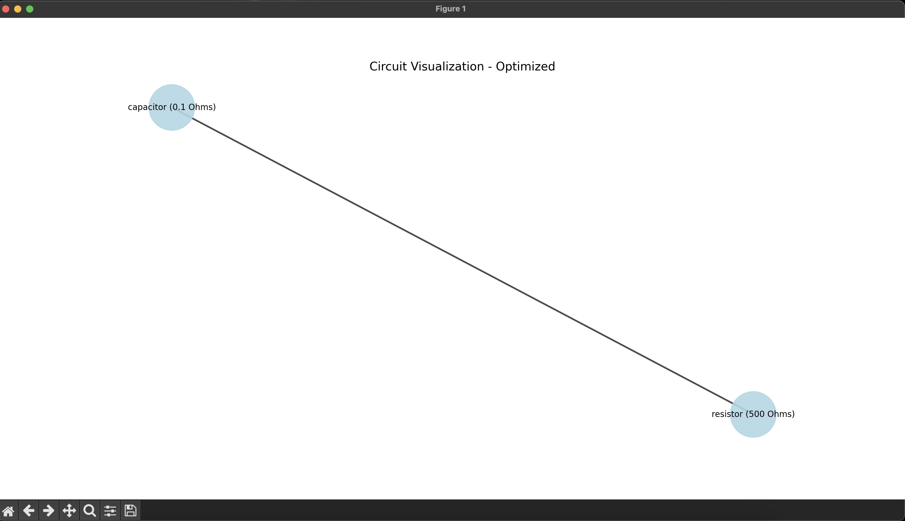

# Neural Network Circuit Optimizer 

The **Neural Network Circuit Optimizer** project aims to optimize simple digital circuits using machine learning, circuit simulation, and optimization algorithms. This tool leverages a neural network to improve circuit efficiency by minimizing component count, power consumption, and execution time.

A Circuit here can have Components like resistors, capacitors, logic gates, and more. 

- **NOTE**: This project is still in its early stages please see the bottom of the page for the current version and progress.

## Technologies and Algorithms

- **NumPy & Pandas**: Used for data manipulation, numerical operations, and organizing circuit data.
- **SymPy**: Helps simplify Boolean logic expressions for circuit optimization.
- **NetworkX**: Represents circuits as graphs, making it easier to analyze and optimize them.
- **Matplotlib**: Visualizes circuit optimizations and results.
- **SimPy**: Simulates circuit behavior for testing and analysis.
- **TensorFlow/PyTorch**: Used to train a neural network for advanced optimization of circuits.
- **SQLAlchemy**: Manages database interactions for storing circuit data and optimization results.
- **Scikit-learn**: Implements machine learning algorithms for optimization tasks.
- **JupyterNotebook/Labs**: Provides an interactive environment for development, testing, and visualization.

## Project Structure

```
NeuralNetworkCircuitOptimizer/
│
├── data/                # Contains input circuits and testing data (JSON files)
├── notebooks/           # Jupyter notebooks for experimentation with algorithms
├── src/                 # Core Python modules for parsing, optimization, simulation, and visualization
│   ├── circuit.py       # Optimizes the circuit using ML algorithms
│   ├── component.py     # Creates the circuit components and adds connections between them
│   ├── optimizer.py     # Optimizes the circuit using simple formulas and algorithms to advanced ML algorithms
│   ├── parser.py        # Parses circuit data (JSON format)
│   ├── simulator.py     # Simulates the circuit behavior using test cases
│   └── visualizer.py    # Visualizes the optimization process and results (displays the circuit as a graph)
├── tests/               # Unit tests for ensuring correctness
├── requirements.txt     # Lists project dependencies
├── README.md            # Project documentation
└── main.py              # Main entry point to run the program
```

## Project Details

- **Circuit Creation**: a Circuits is created using the circuit file where we use the components file to add connection between components and create new ones this collection of components is the circuit. This circuit data is given in a json file and we extract and parse it using the parser file.
- **Optimization**: This file creates a circuit using the circuit file then The circuit is then optimized using a combination of simple formulas and machine learning algorithms this all happens in the optimizer file which has many methods to optimize the circuit.
- **Simulation and Visualization**: The optimized circuit is then simulated using test cases for ex using a test voltage source, this simulated result is returned. Lastly we simulate the optimized circuit as a graph for the user too see.

## End Goal

The main goal of this project is to optimize small digital circuits by using machine learning techniques, specifically a neural network, to minimize the complexity of circuits. This involves reducing the gate count, power usage, and execution time, improving overall efficiency. The project also serves as a great introduction to applying neural networks in hardware optimization.

## V1 of Project! 

Currently the project is in its first version and it has the following features:
- **Circuit Creation**: The project can parse the data json file and create a circuit using the components.
- **Optimization**: The project can optimize the circuit to reduce component count for resistors i.e . if there are two resistors in series they can be combined into one.
- **Simulation and Visualization**: The project can simulate the optimized circuit using a test source and get its power usage. Then display the circuit as a graph.

- **Showcase**
- Data
```json
{
  "components": [
    {"id": 1, "type": "resistor", "value": 300},
    {"id": 2, "type": "capacitor", "value": 0.1},
    {"id": 3, "type": "resistor", "value": 200}
  ],
  "connections": [
    {"from": 1, "to": 2},
    {"from": 2, "to": 3}
  ]
}
```
- Circuit Simulation 

- Circuit Visualization
Before Optimization

After Optimization



